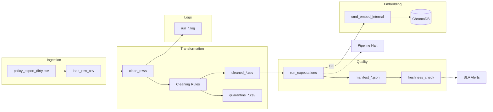

# Kiến trúc pipeline — Lab Day 10

**Nhóm:** Data Observability Group
**Cập nhật:** 2026-04-15

---

## 1. Sơ đồ luồng (bắt buộc có 1 diagram: Mermaid / ASCII)

> **Ghi chú:** Điểm đo **freshness** nằm sau khi tạo manifest; **run_id** được gắn xuyên suốt log, file name và metadata trong vector store.

---

## 2. Ranh giới trách nhiệm

| Thành phần | Input | Output | Owner nhóm |
|------------|-------|--------|--------------|
| Ingest | data/raw/*.csv | List[Dict] | Ingestion Owner |
| Transform | List[Dict] | Cleaned List, Quarantine List | Cleaning Owner |
| Quality | Cleaned List | Results, Halt Signal | Quality Owner |
| Embed | Cleaned CSV | Chroma Collection | Embed Owner |
| Monitor | Manifest JSON | Freshness Status | Monitoring Owner |

---

## 3. Idempotency & rerun

- **Strategy:** Upsert theo `chunk_id`.
- **Rerun:** Khi rerun cùng một pipeline (cùng data hoặc data mới), Chromadb sẽ thực hiện `upsert` dựa trên `chunk_id`.
- **Snapshot Publish:** Pipeline có thêm bước `embed_prune_removed` — xóa các `chunk_id` cũ không còn xuất hiện trong lần clean mới nhất. Điều này đảm bảo Vector database luôn là snapshot chính xác của phiên bản "Golden" hiện tại, tránh duplicate hoặc stale data từ các lần chạy trước.

---

## 4. Liên hệ Day 09

- Pipeline này cung cấp corpus đã được làm sạch cho Agent Day 09.
- Thay vì Agent đọc trực tiếp từ các file `.txt` thô, nó sẽ sử dụng `ChromaDB` đã được pipeline này đồng bộ (sync).
- Collection `day10_kb` đóng vai trò là "Production-ready" store.

---

## 5. Rủi ro đã biết

- **Rate Limit:** Tải model `SentenceTransformers` có thể bị limit nếu rerun quá nhiều lần trên môi trường CI/CD không có cache.
- **Race Condition:** Khi có nhiều pipeline chạy cùng lúc ghi đè vào cùng một Collection (cần khóa hoặc phân tách run_id collection name nếu cần).

